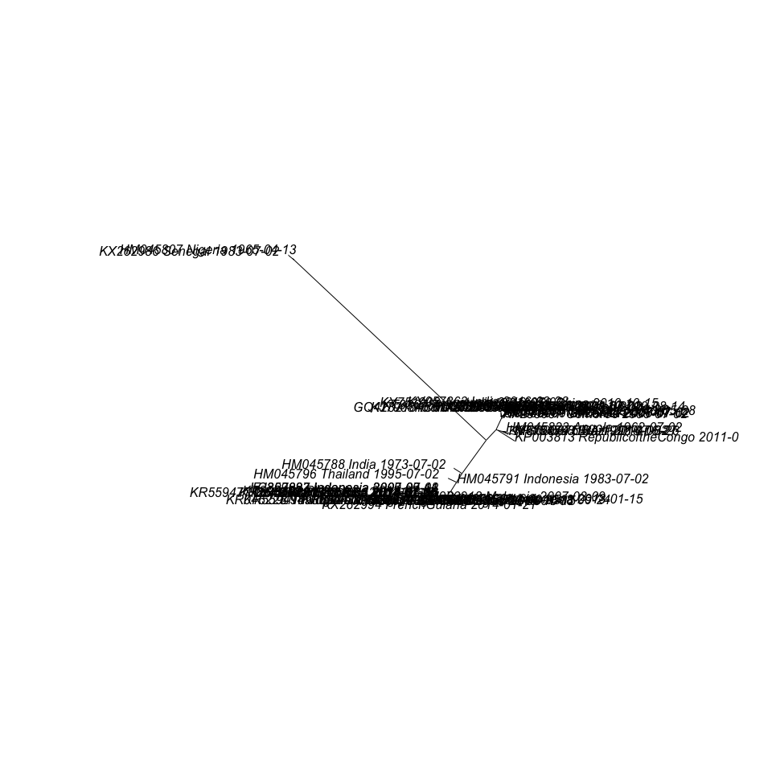
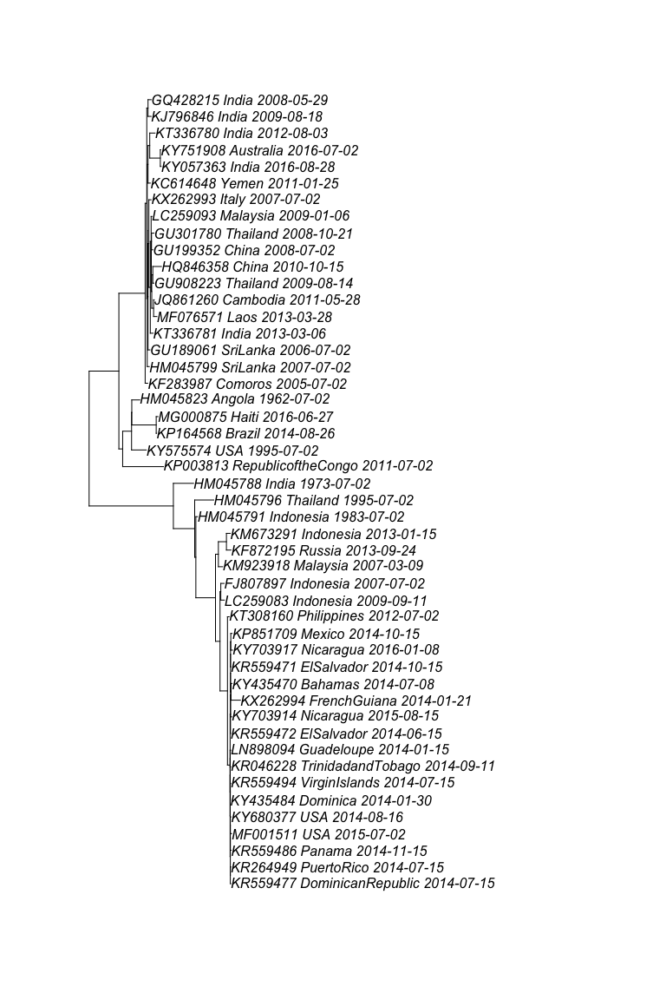
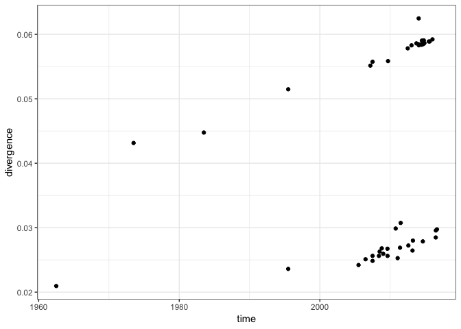
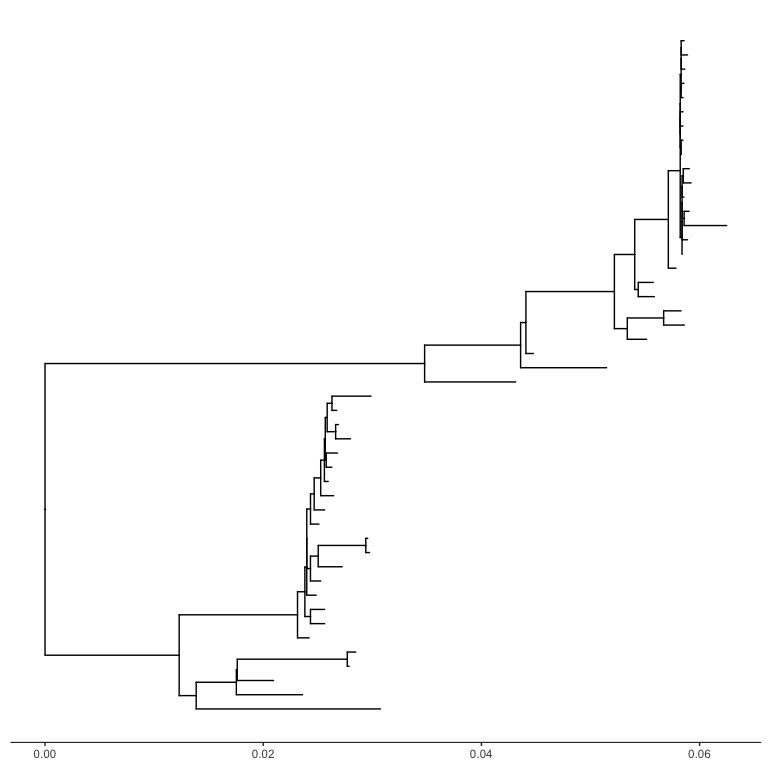
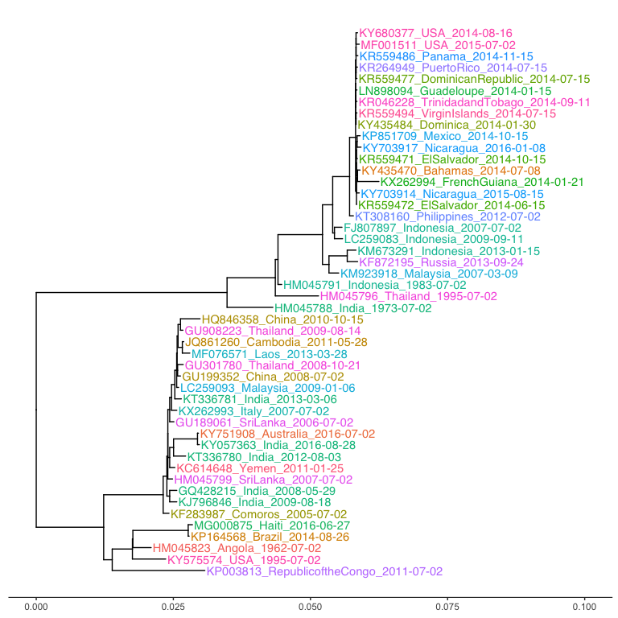
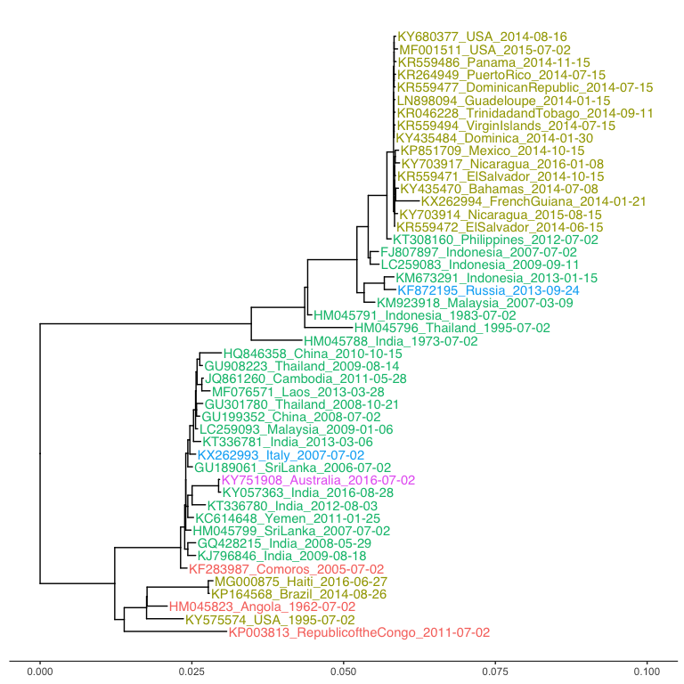

In this tutorial we will create the phylogeny for a set of 50 publically available chikungunya virus genomes and visualize the phylogeny in R. 

First install the necessary libraries:


```r
required_libraries <- c("phangorn", "ape", "magrittr", "dplyr", "lubridate", "ggplot2", "ggtree", "countrycode", "knitr", "devtools")
missing_libraries <- required_libraries[!(required_libraries %in% installed.packages())]
if (length(missing_libraries) > 0) sapply(missing_libraries, install.packages)
invisible(lapply(required_libraries, library, character.only=TRUE))
devtools::install_github("lucymli/EpiGenR")
```

Also install the following programs:

- [muscle v 3.8.31](https://www.drive5.com/muscle) - for multi-sequence alignment (also available via Anacona: conda install muscle)
- [RAxML-NG v0.7.0](https://github.com/amkozlov/raxml-ng/releases) - for maximum likelihood

# Phylogeny building

## Alignment-based phylogenies

### Create multi-sequence alignment

The Chikungunya virus genomes is around 12kb and only encodes 2 polyproteins, which means it is relatively easy to assemble the complete genome and create a multi-sequence alignment. For bacterial genomes, short reads are mapped against a reference genome and only polymorphic sites (SNPs) are included in the alignment.

Run the following commands to align the sequences in 'sequences.fasta'. The alignment might take a couple of minutes.


```bash
muscle3.8.31_i86darwin64 -maxiters 1 -diags -in sequences.fasta -out aln.fasta
```

```
## 
## MUSCLE v3.8.31 by Robert C. Edgar
## 
## http://www.drive5.com/muscle
## This software is donated to the public domain.
## Please cite: Edgar, R.C. Nucleic Acids Res 32(5), 1792-97.
## 
## sequences 50 seqs, max length 12230, avg  length 11767
## 00:00:00      5 MB(0%)  Iter   1    0.08%  K-mer dist pass 1
00:00:00      5 MB(0%)  Iter   1   39.29%  K-mer dist pass 1
00:00:00      5 MB(0%)  Iter   1   78.51%  K-mer dist pass 1
00:00:00      5 MB(0%)  Iter   1  100.00%  K-mer dist pass 1
## 00:00:00      5 MB(0%)  Iter   1    0.08%  K-mer dist pass 2
00:00:00      5 MB(0%)  Iter   1   39.29%  K-mer dist pass 2
00:00:00      5 MB(0%)  Iter   1   78.51%  K-mer dist pass 2
00:00:00      5 MB(0%)  Iter   1  100.00%  K-mer dist pass 2
## 00:00:00     12 MB(0%)  Iter   1    2.04%  Align node       
00:00:02    183 MB(1%)  Iter   1    4.08%  Align node
00:00:04    227 MB(1%)  Iter   1    6.12%  Align node
00:00:06    256 MB(1%)  Iter   1    8.16%  Align node
00:00:08    259 MB(2%)  Iter   1   10.20%  Align node
00:00:10    266 MB(2%)  Iter   1   12.24%  Align node
00:00:11    270 MB(2%)  Iter   1   14.29%  Align node
00:00:13    274 MB(2%)  Iter   1   16.33%  Align node
00:00:16    277 MB(2%)  Iter   1   18.37%  Align node
00:00:18    281 MB(2%)  Iter   1   20.41%  Align node
00:00:20    285 MB(2%)  Iter   1   22.45%  Align node
00:00:22    288 MB(2%)  Iter   1   24.49%  Align node
00:00:24    292 MB(2%)  Iter   1   26.53%  Align node
00:00:26    296 MB(2%)  Iter   1   28.57%  Align node
00:00:28    299 MB(2%)  Iter   1   30.61%  Align node
00:00:30    303 MB(2%)  Iter   1   32.65%  Align node
00:00:31    307 MB(2%)  Iter   1   34.69%  Align node
00:00:33    311 MB(2%)  Iter   1   36.73%  Align node
00:00:35    321 MB(2%)  Iter   1   38.78%  Align node
00:00:37    325 MB(2%)  Iter   1   40.82%  Align node
00:00:39    329 MB(2%)  Iter   1   42.86%  Align node
00:00:41    332 MB(2%)  Iter   1   44.90%  Align node
00:00:43    343 MB(2%)  Iter   1   46.94%  Align node
00:00:45    347 MB(2%)  Iter   1   48.98%  Align node
00:00:48    351 MB(2%)  Iter   1   51.02%  Align node
00:00:50    365 MB(2%)  Iter   1   53.06%  Align node
00:00:52    381 MB(2%)  Iter   1   55.10%  Align node
00:00:53    398 MB(2%)  Iter   1   57.14%  Align node
00:00:55    412 MB(2%)  Iter   1   59.18%  Align node
00:00:57    432 MB(3%)  Iter   1   61.22%  Align node
00:00:59    436 MB(3%)  Iter   1   63.27%  Align node
00:01:01    439 MB(3%)  Iter   1   65.31%  Align node
00:01:02    443 MB(3%)  Iter   1   67.35%  Align node
00:01:04    447 MB(3%)  Iter   1   69.39%  Align node
00:01:06    450 MB(3%)  Iter   1   71.43%  Align node
00:01:08    454 MB(3%)  Iter   1   73.47%  Align node
00:01:10    457 MB(3%)  Iter   1   75.51%  Align node
00:01:12    461 MB(3%)  Iter   1   77.55%  Align node
00:01:14    465 MB(3%)  Iter   1   79.59%  Align node
00:01:16    468 MB(3%)  Iter   1   81.63%  Align node
00:01:18    472 MB(3%)  Iter   1   83.67%  Align node
00:01:20    475 MB(3%)  Iter   1   85.71%  Align node
00:01:22    486 MB(3%)  Iter   1   87.76%  Align node
00:01:24    496 MB(3%)  Iter   1   89.80%  Align node
00:01:26    499 MB(3%)  Iter   1   91.84%  Align node
00:01:27    503 MB(3%)  Iter   1   93.88%  Align node
00:01:30    507 MB(3%)  Iter   1   95.92%  Align node
00:01:31    510 MB(3%)  Iter   1   97.96%  Align node
00:01:33    514 MB(3%)  Iter   1  100.00%  Align node
00:01:36    518 MB(3%)  Iter   1  100.00%  Align node
## 00:01:36    518 MB(3%)  Iter   1    2.00%  Root alignment
00:01:36    518 MB(3%)  Iter   1    4.00%  Root alignment
00:01:36    518 MB(3%)  Iter   1    6.00%  Root alignment
00:01:36    518 MB(3%)  Iter   1    8.00%  Root alignment
00:01:36    518 MB(3%)  Iter   1   10.00%  Root alignment
00:01:36    518 MB(3%)  Iter   1   12.00%  Root alignment
00:01:36    518 MB(3%)  Iter   1   14.00%  Root alignment
00:01:36    518 MB(3%)  Iter   1   16.00%  Root alignment
00:01:36    518 MB(3%)  Iter   1   18.00%  Root alignment
00:01:36    518 MB(3%)  Iter   1   20.00%  Root alignment
00:01:36    518 MB(3%)  Iter   1   22.00%  Root alignment
00:01:36    518 MB(3%)  Iter   1   24.00%  Root alignment
00:01:36    518 MB(3%)  Iter   1   26.00%  Root alignment
00:01:36    518 MB(3%)  Iter   1   28.00%  Root alignment
00:01:36    518 MB(3%)  Iter   1   30.00%  Root alignment
00:01:36    518 MB(3%)  Iter   1   32.00%  Root alignment
00:01:36    518 MB(3%)  Iter   1   34.00%  Root alignment
00:01:36    518 MB(3%)  Iter   1   36.00%  Root alignment
00:01:36    518 MB(3%)  Iter   1   38.00%  Root alignment
00:01:36    518 MB(3%)  Iter   1   40.00%  Root alignment
00:01:36    518 MB(3%)  Iter   1   42.00%  Root alignment
00:01:36    518 MB(3%)  Iter   1   44.00%  Root alignment
00:01:36    518 MB(3%)  Iter   1   46.00%  Root alignment
00:01:36    518 MB(3%)  Iter   1   48.00%  Root alignment
00:01:36    518 MB(3%)  Iter   1   50.00%  Root alignment
00:01:36    518 MB(3%)  Iter   1   52.00%  Root alignment
00:01:36    518 MB(3%)  Iter   1   54.00%  Root alignment
00:01:36    518 MB(3%)  Iter   1   56.00%  Root alignment
00:01:36    518 MB(3%)  Iter   1   58.00%  Root alignment
00:01:36    518 MB(3%)  Iter   1   60.00%  Root alignment
00:01:36    518 MB(3%)  Iter   1   62.00%  Root alignment
00:01:36    518 MB(3%)  Iter   1   64.00%  Root alignment
00:01:36    518 MB(3%)  Iter   1   66.00%  Root alignment
00:01:36    518 MB(3%)  Iter   1   68.00%  Root alignment
00:01:36    518 MB(3%)  Iter   1   70.00%  Root alignment
00:01:36    518 MB(3%)  Iter   1   72.00%  Root alignment
00:01:36    518 MB(3%)  Iter   1   74.00%  Root alignment
00:01:36    518 MB(3%)  Iter   1   76.00%  Root alignment
00:01:36    518 MB(3%)  Iter   1   78.00%  Root alignment
00:01:36    518 MB(3%)  Iter   1   80.00%  Root alignment
00:01:36    518 MB(3%)  Iter   1   82.00%  Root alignment
00:01:36    518 MB(3%)  Iter   1   84.00%  Root alignment
00:01:36    518 MB(3%)  Iter   1   86.00%  Root alignment
00:01:36    518 MB(3%)  Iter   1   88.00%  Root alignment
00:01:36    518 MB(3%)  Iter   1   90.00%  Root alignment
00:01:36    518 MB(3%)  Iter   1   92.00%  Root alignment
00:01:36    518 MB(3%)  Iter   1   94.00%  Root alignment
00:01:36    518 MB(3%)  Iter   1   96.00%  Root alignment
00:01:36    518 MB(3%)  Iter   1   98.00%  Root alignment
00:01:36    518 MB(3%)  Iter   1  100.00%  Root alignment
00:01:36    518 MB(3%)  Iter   1  100.00%  Root alignment
```

### Use model test to determine best fitting nucleotide substitution model

A list of such models is here available here: http://evomics.org/resources/substitution-models/nucleotide-substitution-models/

Essentially these models make different assumptions about the base frequencies, the differences in transition and transversion rates, and heterogeneity in the rate of substitution across the genome.

You can use ModelTest to select the best model for your data. The best model is selected based on [AIC](https://en.wikipedia.org/wiki/Akaike_information_criterion#AICc) (Akaike Information Criterion) or [BIC](https://en.wikipedia.org/wiki/Bayesian_information_criterion) (Bayesian Information Criterion) scores, which take into account both the likelihood (how well does your model explain your data) and the complexity of the model. Ideally you want the simplest model that best explains your data.

The ModelTest program is available as a [GUI](https://github.com/ddarriba/jmodeltest2) and as a more efficient [commandline tool](https://github.com/ddarriba/modeltest). For this tutorial we'll use the R function that implements ModelTest. The following commands should take about a minute to run.


```r
modeltest_results <- 
  ape::read.FASTA("aln.fasta") %>%
  phangorn::phyDat() %>%
  phangorn::modelTest(multicore=TRUE, mc.cores=4)
```

```
## negative edges length changed to 0!
```

Usually it's best to pick a model that comes top according to both AIC and BIC score (small scores are better). Usually the corrected AICc score (AICc) is used as it reduces the risk of overfitting with small sample sizes. 


```r
arrange(modeltest_results, AICc) %>%
  select(c(Model, df, logLik, AICc)) %>%
  head (3)
```

```
##     Model  df    logLik     AICc
## 1 GTR+G+I 107 -36902.48 74020.84
## 2   GTR+G 106 -36906.88 74027.62
## 3   GTR+I 106 -36918.84 74051.53
```


```r
arrange(modeltest_results, BIC) %>%
  select(c(Model, df, logLik, BIC)) %>%
  head (3)
```

```
##     Model  df    logLik      BIC
## 1   GTR+G 106 -36906.88 74812.31
## 2 GTR+G+I 107 -36902.48 74812.91
## 3   GTR+I 106 -36918.84 74836.21
```

The GTR model comes top according to both the AICc and BIC scores. In general, AIC scores have a tendency to favour more complex models whereas BIC has a tendency to favor smaller models.

For downstream analysis we will use use the GTR+G+I model to build the phylogeny as it was selected as the best model according to AICc and had a similar BIC score to GTR+G according to BIC.

In the GTR+G+I model, the assumptions are:

- Unequal base frequencies
- 6 different mutation rates
- Mutation rate of A -> G = rate of G -> A, and similarly for the 5 other pairs of bases

### Maximum likelihood phylogeny reconstruction using RAxML

The following command can be used to construct maximum likelihood phylogeny based on the the multi-sequence alignment and the nucleotide substitution model selected above. This should take about 10s to run.


```bash
mkdir raxml
raxml-ng --msa aln.fasta --model GTR+G+I --prefix raxml/mltree
```

```
## 
## RAxML-NG v. 0.7.0 BETA released on 22.10.2018 by The Exelixis Lab.
## Authors: Alexey Kozlov, Alexandros Stamatakis, Diego Darriba, Tomas Flouri, Benoit Morel.
## Latest version: https://github.com/amkozlov/raxml-ng
## Questions/problems/suggestions? Please visit: https://groups.google.com/forum/#!forum/raxml
## 
## WARNING: This is a BETA release, please use at your own risk!
## 
## RAxML-NG was called as follows:
## 
## raxml-ng --msa aln.fasta --model GTR+G+I --prefix raxml/mltree
## 
## Analysis options:
##   run mode: ML tree search
##   start tree(s): random (1)
##   random seed: 1543349656
##   tip-inner: OFF
##   pattern compression: ON
##   per-rate scalers: OFF
##   site repeats: ON
##   fast spr radius: AUTO
##   spr subtree cutoff: 1.000000
##   branch lengths: linked (ML estimate, algorithm: NR-FAST)
##   SIMD kernels: AVX2
##   parallelization: PTHREADS (8 threads), thread pinning: OFF
## 
## [00:00:00] Reading alignment from file: aln.fasta
## [00:00:00] Loaded alignment with 50 taxa and 12335 sites
## 
## WARNING: Fully undetermined columns found: 5
## 
## NOTE: Reduced alignment (with duplicates and gap-only sites/taxa removed) 
## NOTE: was saved to: /Users/lucy.li/Documents/projects/cupcakes/2018/phylogenetics/raxml/mltree.raxml.reduced.phy
## 
## Alignment comprises 1 partitions and 1134 patterns
## 
## Partition 0: noname
## Model: GTR+FO+I+G4m
## Alignment sites / patterns: 12330 / 1134
## Gaps: 4.56 %
## Invariant sites: 1.44 %
## 
## 
## NOTE: Binary MSA file created: raxml/mltree.raxml.rba
## 
## [00:00:00] Generating 1 random starting tree(s) with 50 taxa
## [00:00:00] Data distribution: max. partitions/sites/weight per thread: 1 / 142 / 2272
## 
## Starting ML tree search with 1 distinct starting trees
## 
## [00:00:00 -113664.532347] Initial branch length optimization
## [00:00:00 -87192.405753] Model parameter optimization (eps = 10.000000)
## [00:00:00 -59585.140204] AUTODETECT spr round 1 (radius: 5)
## [00:00:01 -47114.263060] AUTODETECT spr round 2 (radius: 10)
## [00:00:01 -39814.726422] AUTODETECT spr round 3 (radius: 15)
## [00:00:01 -39814.726417] SPR radius for FAST iterations: 10 (autodetect)
## [00:00:01 -39814.726417] Model parameter optimization (eps = 3.000000)
## [00:00:02 -37256.838637] FAST spr round 1 (radius: 10)
## [00:00:03 -36593.711514] FAST spr round 2 (radius: 10)
## [00:00:03 -36552.114456] FAST spr round 3 (radius: 10)
## [00:00:03 -36544.935647] FAST spr round 4 (radius: 10)
## [00:00:04 -36544.935317] Model parameter optimization (eps = 1.000000)
## [00:00:04 -36514.293703] SLOW spr round 1 (radius: 5)
## [00:00:05 -36513.097831] SLOW spr round 2 (radius: 5)
## [00:00:05 -36513.097695] SLOW spr round 3 (radius: 10)
## [00:00:06 -36513.097642] SLOW spr round 4 (radius: 15)
## [00:00:07 -36513.097595] SLOW spr round 5 (radius: 20)
## [00:00:07 -36513.097549] SLOW spr round 6 (radius: 25)
## [00:00:08 -36513.097504] Model parameter optimization (eps = 0.100000)
## 
## [00:00:08] ML tree search #1, logLikelihood: -36510.504617
## 
## 
## Optimized model parameters:
## 
##    Partition 0: noname
##    Rate heterogeneity: GAMMA (4 cats, mean),  alpha: 4.049050 (ML),  weights&rates: (0.250000,0.457037) (0.250000,0.776888) (0.250000,1.084390) (0.250000,1.681685) 
##    P-inv (ML): 0.529672
##    Base frequencies (ML): 0.301676 0.243918 0.250822 0.203583 
##    Substitution rates (ML): 1.085359 7.998175 1.928957 0.295673 22.930388 1.000000 
## 
## Final LogLikelihood: -36510.504617
## 
## AIC score: 73235.009234 / AICc score: 73236.900250 / BIC score: 74028.926828
## Free parameters (model + branch lengths): 107
## 
## Best ML tree saved to: /Users/lucy.li/Documents/projects/cupcakes/2018/phylogenetics/raxml/mltree.raxml.bestTree
## Optimized model saved to: /Users/lucy.li/Documents/projects/cupcakes/2018/phylogenetics/raxml/mltree.raxml.bestModel
## 
## Execution log saved to: /Users/lucy.li/Documents/projects/cupcakes/2018/phylogenetics/raxml/mltree.raxml.log
## 
## Analysis started: 27-Nov-2018 12:14:16 / finished: 27-Nov-2018 12:14:25
## 
## Elapsed time: 8.362 seconds
```

To quantify the uncertainty in tree topology, we can compute the bootstrap values of the branching points by repeating the phylogeny building step with bootstrap samples of the sequences. Let rows in the multi-sequence alignment be samples and columns be positions into the genome, then a boostrap sample involves resampling with replacement of the columns. The bootstrap value is the proportion of bootstraps containig a branching point. Ideally we want >80% bootstrap values.

We will skip this step for now for the sake of time, but this is the command you can use to calculate the bootstrap values:


```bash
raxml-ng --all --msa aln.fasta --model GTR+G+I --bs-trees 200 --prefix raxml/raxmlbootstrap
```

### Bayesian approaches

This won't be covered today, but Bayesian methods for phylogenetic reconstruction can provide estimates of times of divergence in addition to genetic relatedness. This can be useful for infectious diseaes analyses, e.g. when estimating the date of introduction of a new pathogen. Common tools include [BEAST](http://beast.community/) and [MrBayes](http://nbisweden.github.io/MrBayes/). However, these methods are slow as they try reconstruct a distribution of plausible trees. Practically, these methods can only be used for a few hundred pathogen sequences.

## Kmer-based phylogenies

An alternative to alignment-based methods is by comparing k-mers from short-read data (not covered in this session). The trees on IDseq are based on this approach.

The kmer approach is useful as it is generally more parallelizeable and thus scalable.

However, the phylogeny might not be as accurate.

# Phylogeny visualization

## Standalone software/tools

- Geneious
- FigTree
- Dendroscope

and [many more...](https://en.wikipedia.org/wiki/List_of_phylogenetic_tree_visualization_software)

## Visualization in R

The advantage of using R and other scripting languages to process trees is that it is reproducible. If the analysis pipeline or data changes, the visualization steps are much easier to replicate than using a GUI tool. The trees can be output as PDFs and prettified e.g. in Illustrator for final publication.

The `ape` library contains a set of very useful functions for processing and manipulating trees. The `read.tree()` function reads the tree in newick format into a `phylo` object in R.

### Load tree


```r
mltree <- ape::read.tree("raxml/mltree.raxml.bestTree")
```

As you can see below, the `phylo` object contains information about edges, edge lengths, number of internal nodes, tip labels, and whether the tree is rooted.


```r
str(mltree)
```

```
## List of 5
##  $ edge       : int [1:97, 1:2] 51 52 53 54 54 53 55 55 56 56 ...
##  $ edge.length: num [1:97] 0.000001 0.000083 0.000001 0.000166 0.000249 0.000001 0.000333 0.000001 0.000582 0.000269 ...
##  $ Nnode      : int 48
##  $ tip.label  : chr [1:50] "KR559477_DominicanRepublic_2014-07-15" "KR264949_PuertoRico_2014-07-15" "KR559486_Panama_2014-11-15" "MF001511_USA_2015-07-02" ...
##  $ root.edge  : num 0
##  - attr(*, "class")= chr "phylo"
##  - attr(*, "order")= chr "cladewise"
```

### Rooting the phylogeny


By default, the tree reconstructed in RAxML is unrooted. To root the tree, we need to select one or more samples as the outgroup. These samples should be sufficiently distinct from the other samples, but not too divergent that distance score cannot be computed. One way to determine the outgroup is by visualizing the tree. 

`ape` provides an function to quickly visualize the tree, although the default output is not pretty.


```r
plot(mltree, type="unrooted", show.tip.label = TRUE)
```

<!-- -->

As you can see, there are a couple of samples that are clearly distinct from the other samples. We can use these two as the outgroup for rooting the tree (`root()`). Usually the outgroup is removed from downstream analysis (`drop.tip()`).


```r
auto_root_tree <- function (tree) {
  longest_edge <- which.max(tree$edge.length)
  outgroup_tips <- extract.clade(tree, tree$edge[longest_edge, 2])$tip.label
  rooted_tree <- root(tree, outgroup_tips, resolve.root=TRUE)
  drop.tip(rooted_tree, outgroup_tips)
}
rooted_mltree <- auto_root_tree(mltree)
plot(rooted_mltree)
```

<!-- -->

There are two distinct clusters of Chikungunya virus.

For infectious disease outbreak analyses, the outgroup often comprises samples of the same species but from an earlier time period or circulating in a different part of the world.

Sometimes a good outgroup does not exist, e.g. for novel pathogens or new strains of an existing pathogen. In such cases, we can use the time of collection to deduce the most likely root. We assume that the rate of substitution stays fairly constant over time within a strain, so samples taken in more recent times should have more divergence relative to the root of the tree than older samples. 

We can visually check the correlation between divergence and time:


```r
ggplot(EpiGenR::root2tip.divergence(rooted_mltree), aes(x=time, y=divergence)) +
  theme_bw() + 
  geom_point()
```

<!-- -->

This plot confirms the presence of two lineages, with seemingly different rates of substitution. This concurs with [existing literature](https://jvi.asm.org/content/84/13/6497) that shows the Asian lineage evolves twice as quickly than the ECSA lineage.

### Adding metadata

While the tree itself provides information regarding the genetic relatedness of samples, the more interesting questions are often in linking the relatedness to additional metadata.

`ggtree` is a useful package for adding metadata to phylogenetic visualizations, although its documentation is somewhat sparse. Its usage is based on the `ggplot` grammar. 


```r
tree_plot <- ggtree(rooted_mltree) +
  theme_tree2() 
tree_plot
```

<!-- -->

For this example, both the spatial and temporal information are stored in the tip label strings.


```r
metadata <- strsplit(rooted_mltree$tip.label, "_") %>%
  do.call(what=rbind) %>%
  as.data.frame(., stringsAsFactors=FALSE) %>%
  rename(., ID=V1, Country=V2, Date=V3) %>%
  mutate(ID=rooted_mltree$tip.label, Country=factor(Country), Date=as.Date(Date))
```

Annoyingly ggtree does not automatically adjust the plot size to accommodate the tip labels, so some manual tweaking using `xlim()` might be necessary.


```r
tree_plot_country <- tree_plot %<+% metadata +
  geom_tiplab(aes(color=Country)) +
  xlim(0, 0.10)
tree_plot_country
```

<!-- -->

Given the number of countries in the dataset, the Continent might be a better grouping for coloring.


```r
metadata$Continent <- metadata$Country %>%
  gsub("([a-z])([A-Z])", "\\1 \\2", .) %>%
  gsub("Virgin Islands", "US Virgin Islands", .) %>%
  countrycode(., origin='country.name', destination="continent")
```


```r
tree_plot_continent <- tree_plot %<+% metadata +
  geom_tiplab(aes(color=Continent)) +
  xlim(0, 0.10)
tree_plot_continent
```

<!-- -->

From the above plot, it's clear that the chikungunya virus outbreak in the Americas a few years ago was the result of importation from the South East Asia region.

### Export plots


```r
ggsave("tree_plot_continent.pdf", tree_plot_continent, width=8, height=8)
```

## Interactive display in javascript

In addition to generating static phylogenies, there are various tools now available that enable interactivity. An example is [Nextstrain](Nextstrain
https://nextstrain.org/) by Trevor Bedford's group at Fred Hutchinson.

Also, we are developing an interactive tool here at the Biohub for tracking the spread of antimicrobial resistant bacteria in California and beyond:

- https://bcrew.czbiohub.org (username: demo; password: demo)


